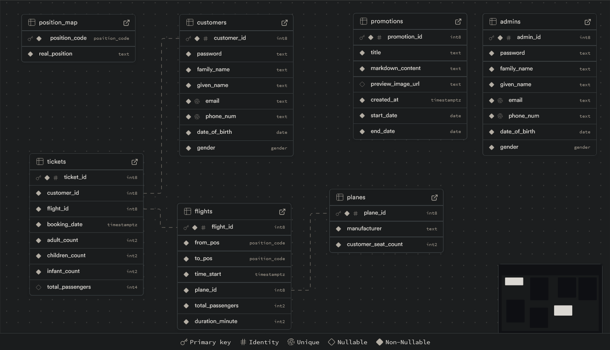

<p align="center" style="vertical-align:middle">
  <a href="https://nestjs.com/" target="blank"></a><br /><a href="https://supabase.com/" target="blank"></a>
</p>

[circleci-image]: https://img.shields.io/circleci/build/github/nestjs/nest/master?token=abc123def456
[circleci-url]: https://circleci.com/gh/nestjs/nest

## Description

This is a simple Airline back-end Project using [NestJs](https://nestjs.com/) and [Supabase](https://supabase.com/).

## Project setup

### Install Dependencies

```bash
$ npm install
```

### Environment Variables

Create a `.env` file based on [.env.example](.env.example) and configure the following:

- `SUPABASE_URL`: Your Supabase project's URL.
- `SUPABASE_KEY`: Public API key for Supabase.
- `SUPABASE_JWT_SECRET`: Supabase's secret key.
- `JWT_SECRET_KEY`: JWT key for authentication.
- `BCRYPT_SALT_ROUNDS`: Salt rounds for password encryption.

## Compile and run the project

```bash
# development
$ npm run start

# watch mode
$ npm run start:dev

# production mode
$ npm run start:prod
```

## Provided Features

- **Cloud PostgreSQL Database**  
  Data is stored in a PostgreSQL database hosted on Supabase, enabling secure and scalable storage.

- **MVC Architecture**  
  The project follows the Model-View-Controller (MVC) design pattern provided by NestJS for clean and maintainable code.

- **Role-based API Guard with JWT Authentication**  
  Users are categorized into two roles:  
  - `Customer`: Limited access to public endpoints.  
  - `Admin`: Full access to manage resources.  
  Authentication is secured using JSON Web Tokens (JWT).

- **Rate Limiting**  
  Protects the API from abuse by limiting requests to 70 requests per second.

- **Caching for GET endpoints**  
  Caching every GET endpoint with fixed cache lifetime of 300 seconds (Not recommended, some endpoints need shorter cache lifetime to show newest data from database).

- **Password Encryption**  
  Password hasing with [bcrypt](https://github.com/kelektiv/node.bcrypt.js).


## Database structure



## License

Nest is [MIT licensed](https://github.com/nestjs/nest/blob/master/LICENSE).
